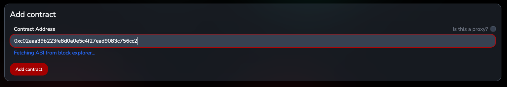
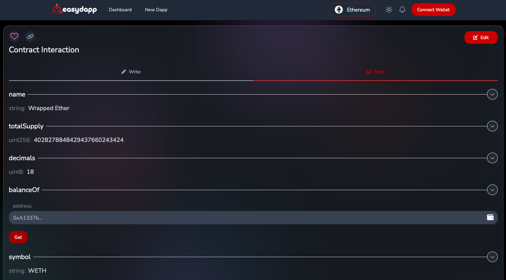
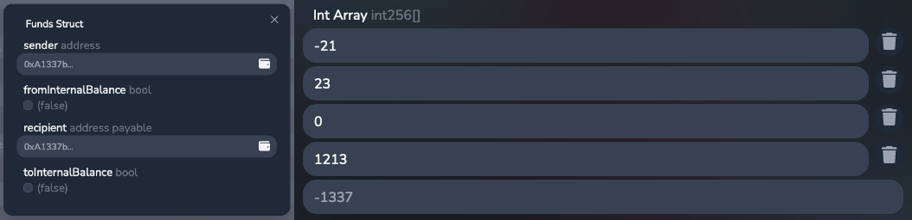
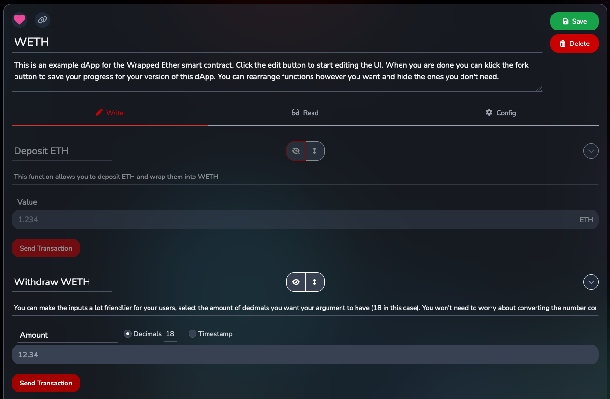
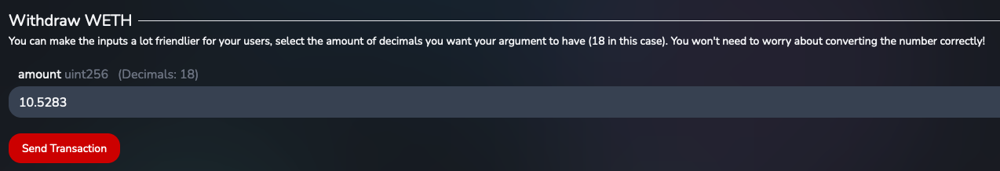
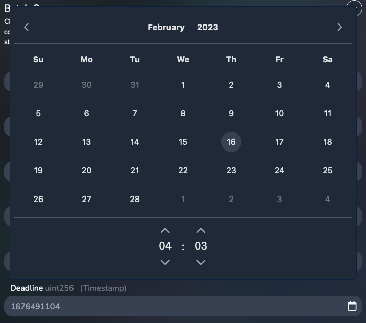
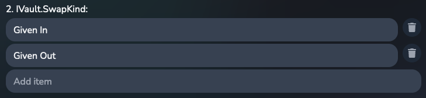
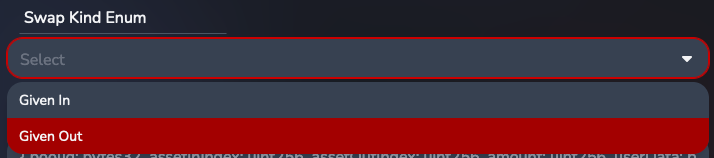
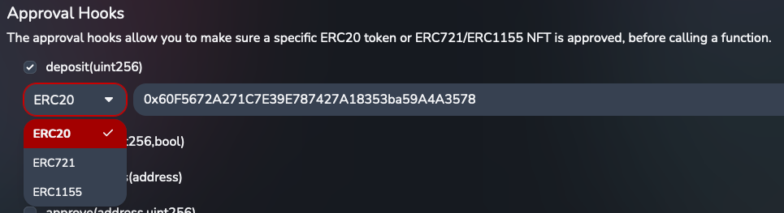

# Easy dAapp

[EasyDapp](https://easyd.app) is a powerful smart contract interaction tool that allows users to simply input a contract address, and start interacting with it through a user-friendly interface. It allows you to customize the UI and upload it to share it with users, collaborators and customers through a unique URL. With a range of features and customization options, including human-readable inputs and outputs, configurable numbers, time pickers, enum dropdowns, approval hooks, and forking capabilities, EasyDapp is a versatile tool for Solidity developers, freelancers, project teams, multisig signers, and anyone else looking to interact with smart contracts on a variety of networks.

https://easyd.app

---

## Contents

- [TLDR](#tldr)
- [Who is it for?](#who-is-it-for)
- [Features](#features)
  - [Start interacting with a smart contract](#start-interacting-with-a-smart-contract)
  - [No more weird tuple inputs!](#no-more-weird-tuple-inputs)
  - [Editing, saving and sharing dApps with others](#editing-saving-and-sharing-dapps-with-others)
  - [Supported networks & local development](#supported-networks--local-development)
  - [Configure numbers: decimals, timestamps, enums](#configure-numbers-decimals-timestamps-enums)
  - [Approval hooks for token and NFT interactions](#approval-hooks-for-token-and-nft-interactions)
  - [Linking other dApps](#linking-to-other-dapps-from-your-dapp-and-factory-contracts)
  - [Forking dApps](#forking-capabilities-to-adjust-dapps-to-your-needs)
- [Development server](#development-server)
- [Feature requests and Bugs](#feature-requests-and-bugs)
- [Contributing](#contributing)

---

## TLDR

You can explore two example dapps on your own, that demonstrate most of the features here!

- [Example WETH dApp](https://easyd.app/app/0xee8bcf545bf80682b78d99f65742d34166cb0405/weth)
- [Example Balancer dApp](https://easyd.app/app/0xee8bcf545bf80682b78d99f65742d34166cb0405/balancer-vault)

---

## Who is it for?

### Solidity developers

EasyDapp provides a simple and user-friendly interface for developers to interact with their smart contracts, without having to write scripts. It also makes it easy to test different functions on a variety of networks, including local development networks.

### Front-end and back-end developers

EasyDapp provides an easy way to see how to integrate a contract into a dApp.

### Solidity freelancers

EasyDapp allows freelancers to provide a user-friendly interface with their code, without having to spend weeks building it from scratch.

### Project teams

EasyDapp provides a way for teams to quickly create a UI to collaborate on projects or serve a UI for their customers, for use cases such as staking, NFT minting, and more.

### Multisig signers

EasyDapp provides a simple way for multisig signers to interact with smart contracts, without having to write scripts or use command line interfaces.

---

## Features

### Start interacting with a smart contract

Create a new dApp [here](https://easyd.app/new-dapp). When pasting the contract address on a supported network, EasyDapp will automatically fetch the ABI from Etherscan if the contract is verified.

The ABI will be parsed automatically and EasyDapp will generate a UI for you. In a similar fashion to EasyDapp the functions will be divided between read and write functions.

### No more weird tuple inputs!

Etherscan can make it tricky to input structs and arrays. EasyDapp creates easy inputs for structs, dynamic and static arrays, even arrays of structs!

### Editing, saving and sharing dApps with others

You can customize the UI of your dApp by adding a title and description for the contract and any function. You can also give custom names to any parameter.

Choose which functions you want to display to a user and in what order. When you are happy with the final result, save your dApp under a custom URL so you can share it with others!

### Supported networks & local development

EasyDapp supports a variety of L1 (ETH, BSC, ...) and L2 (Polygon, Arbitrum, ...) networks, as well as their test networks.

A local mode is also included that can connect to a local development network, such as Hardhat or Ganache. When in local mode, dApps are saved locally in a users browser.

### Configure numbers: decimals, timestamps, enums

A number input or output can be automatically configured to be treated as a number with decimals (very handy for ERC20 token interactions).

When dealing with timestamps, a time picker can be a lot easier to use than a unix timestamp. Outputs can also be configured to be displayed as a date string instead of a unix timestamp.

Enums can be especially annoying to deal with, as their definition is not stored in the ABI. EasyDapp allows you to define the enum values yourself, and will automatically create a dropdown for you.

### Approval hooks for token and NFT interactions

Some functions require an ERC20 token or an NFT to be approved before they can be called. EasyDapp allows you to define approval hooks for your functions, which will automatically check whether a user approved a certain token or NFT. If not, it will automatically approve the token or NFT before calling the function.

### Linking to other dApps from your dApp and factory contracts

If a read function of a contract returns an address, you can mark it as a contract. This will create a hyperlink which will open a new contract interaction page for that address, if it's verified on Etherscan.

You can even provide a link to a dApp created for that contract, which will forward the user to a specific URL instead of a generic contract interaction page.

This feature also supports factory contracts! You only need to create a custom dApp for a single child contract and it will work for any contract address created by the factory.

### Forking capabilities to adjust dApps to your needs

If you see a dApp that you like, you can easily fork it and adjust it to your needs. The dApp will then be saved under your own account and you can share it with others.

---

## Development server

This website is built using Angular. Run `ng serve --configuration=production` for a local dev server. Navigate to `http://localhost:4200/`. The app will automatically reload if you change any of the source files. The production configuration is required if you want to connect to the backend server hosting the dapps.

---

## Feature requests and Bugs

If you have a feature request or found a bug, please open an issue on this repository. If you have a feature request, please include a description of the feature and how you would like to use it. If you found a bug, please include a description of the bug and steps to reproduce it.

---

## Contributing

If you want to contribute to this project, please open a pull request.
